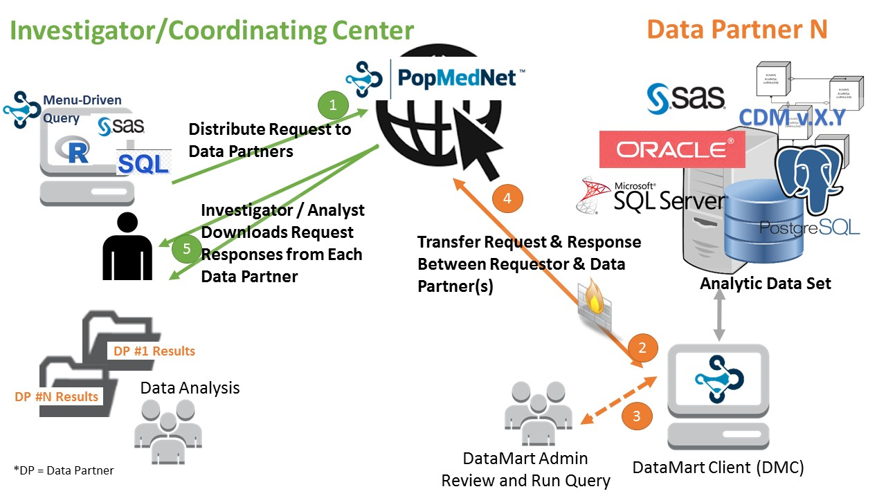

# Summary

PopMedNet&trade; is an open-source application used to facilitate multi-site health data networks [@Brown:2010]. It uses a distributed network design that enables data partners to retain full control of their data. Investigators send questions to data partners for review and response. PopMedNet eliminates the need for assembling patient records in a centralized repository, thus preserving patient privacy and confidentiality.

Its development was pioneered by the Therapeutics Research and Infectious Disease Epidemiology (TIDE) group of the Department of Population Medicine (DPM) of the Harvard Pilgrim Health Care Institute (HPHCI), an appointing department of the Harvard Medical School.

# Statement of need

Distributed health network plays an important role in supporting a number of population health activities [@Brown:2010]. 

The goal of PopMedNet&trade; is to facilitate distributed analysis of electronic health data in order to support medical product safety surveillance, disease surveilance, comparative effectiveness, quality, medical resource use, cost-effectiveness, and related studies. It does this by enabling the creation of health data networks that allows the data owners to keep and control uses of their data, while at the same time allows customized access and governance for each network [@Davies:2016; @Malenfant:2015].

The concerns of the network stakeholders are addressed in the design and governance models of the PopMedNet&trade; software platform. 

PopMedNet&trade; features include distributed querying, customizable workflows, and auditing and search capabilities. Its flexible role-based access control system enables the enforcement of varying governance policies.

# Architecture

PopMedNet&trade; has two components. It has a .NET web application component (Portal) and a Windows desktop application component (DataMart Client). The .NET web component uses a modern service oriented architecture (SOA) with a robust API serving a dynamic UI using the MVVM pattern. The DataMart Client (DMC), uses a plugin architecture to support different types of adapters for querying data. A variety of adapters are available, and able to support file transfer, ad-hoc SQL queries, and dynamically composed queries against local data sources (including SQL Server, Postgres and Oracle).

PopMedNet&trade; is a .NET Framework application, utilizing ASP.NET MVC5 for the implementation of the website application and WinForms for the desktop application. Entity Framework 6 is used for data access, and Typescript for client-side scripting.

# How does PopMedNet&trade; work?

In PopMedNet&trade;, the Portal handles all the governance and acts as a hub for all queries. That ensures that the coordinating center can expect:

* Consistency of information across data partners
* Quality of data
* Flexibility to handle different network structures with overlapping data partners
* Ability to track and report operational activities 
* Managing multiple projects

The DMC allows data partners to control access to their data before sending it to the Portal. For the data partners, it will:

* Provide protection of Protected Health Information (PHI is defined as any personal health information that can potentially identify an individual)
* Prevent loss of control over proprietary information

The researcher will have no direct access to data but is shielded from the differences among networks’ data models.

A typical PopMedNet&trade; request-response cycle is as follows:

1. Request: Investigators distribute data requests constructed in the point and click web interface
2. Review: Data Partners receive and review requests in their DataMart Client
3. Respond: Data partners execute the requests against their local data and upload results 
4. Download: Investigators access results in the query tool

# Comparison to i2b2 and SHRINE

i2b2 (Informatics for Integrating Biology & the Bedside) is a flexible query tool in use in many US hospitals.
Each i2b2 instance comprises a collection of cells called a “hive”. This architecture supports extensibility via add-ons through 
additional cells.

SHRINE (Shared Health Research Informatis NEtwork) is an i2b2 extension for supporting distributed queries. Each SHRINE instance consists of two hives, 
the client and the server. SHRINE instances communicate through 
the SPIN federated query language [@McMurry:2013].

Architecturally, PopMedNet&trade; uses a more tightly coupled hub-and-spoke distribution strategy while SHRINE uses a more loosely coupled, mesh strategy.
While SHRINE requires immediate query response from the data sources in a single session, PopMedNet&trade; allows request-responses to be conducted over multiple sessions.
From a user-interface perspective, i2b2/SHRINE uses a drag-and-drop model, while PopMedNet&trade; uses a menu-driven model.

A SHRINE-PopMedNet&trade; was prototyped to give SHRINE queries the ability to span sessions and conversely to give PopMedNet&trade; the ability to participate in a SHRINE network.

# Acknowledgements

PopMedNet&trade; [@PopMedNet] was developed and has been extended as part of several contracts awarded by a range of federal, state, and industry stakeholders:

* FDA's [Sentinel Initiative](https://www.sentinelinitiative.org)
* PCORI’s National Patient-Centered Clinical Research Network ([PCORnet](https://pcornet.org))

In addition, Harvard Pilgrim Health Care Institute 
serves as the coordinating center for several other initiatives that use PMN and its associated software ecosystem including:

* Biologics and Biosimilars Collective Intelligence Consortium (BBCIC) 
* Office of the Assistant Secretary for Planning and Evaluation (ASPE) & Food and Drug Administration 
* Privacy-protecting distributed analysis of biomedical big data project funded by  the National Institute of Biomedical Imaging and Bioengineering of the National Institutes of Health

# References

